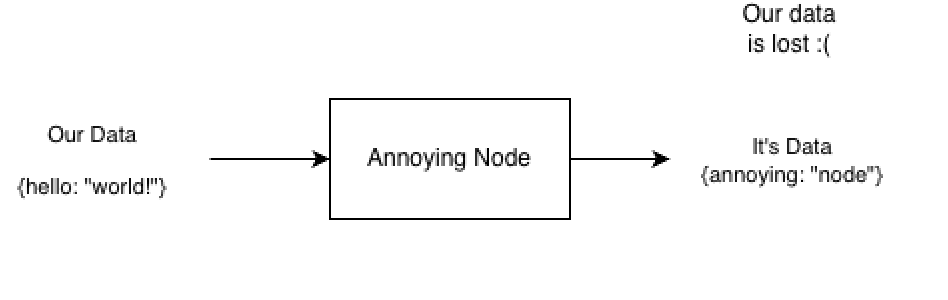
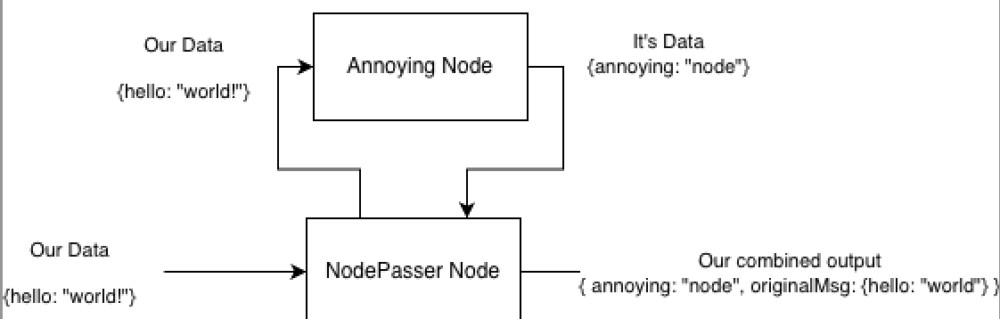

# node-red-contrib-node-passer

A simple utility node for a common Node-RED annoyance — when a node doesn't forward its input, but you still need access to that input's context downstream.

## Problem


## Answer


## Example
```json
[
    {
        "id": "7f34f7ed34fdd5e9",
        "type": "node-passer-node",
        "z": "2073d781375bc5f3",
        "name": "",
        "x": 650,
        "y": 280,
        "wires": [
            [
                "9330575b23416757"
            ],
            [
                "1d1dfb2a9b8bb8fa"
            ]
        ]
    },
    {
        "id": "9330575b23416757",
        "type": "function",
        "z": "2073d781375bc5f3",
        "name": "Annoying",
        "func": "return {\n    payload: \"i replaced the whole message!\"\n}",
        "outputs": 1,
        "timeout": 0,
        "noerr": 0,
        "initialize": "",
        "finalize": "",
        "libs": [],
        "x": 660,
        "y": 220,
        "wires": [
            [
                "7f34f7ed34fdd5e9",
                "17370482dea09bbc"
            ]
        ]
    },
    {
        "id": "17370482dea09bbc",
        "type": "debug",
        "z": "2073d781375bc5f3",
        "name": "Without node passer",
        "active": true,
        "tosidebar": true,
        "console": false,
        "tostatus": false,
        "complete": "true",
        "targetType": "full",
        "statusVal": "",
        "statusType": "auto",
        "x": 880,
        "y": 200,
        "wires": []
    },
    {
        "id": "f29d4b35304945ba",
        "type": "inject",
        "z": "2073d781375bc5f3",
        "name": "",
        "props": [
            {
                "p": "payload"
            },
            {
                "p": "topic",
                "vt": "str"
            }
        ],
        "repeat": "",
        "crontab": "",
        "once": false,
        "onceDelay": 0.1,
        "topic": "",
        "payload": "",
        "payloadType": "date",
        "x": 440,
        "y": 280,
        "wires": [
            [
                "7f34f7ed34fdd5e9"
            ]
        ]
    },
    {
        "id": "1d1dfb2a9b8bb8fa",
        "type": "debug",
        "z": "2073d781375bc5f3",
        "name": "With node passer",
        "active": true,
        "tosidebar": true,
        "console": false,
        "tostatus": false,
        "complete": "true",
        "targetType": "full",
        "statusVal": "",
        "statusType": "auto",
        "x": 870,
        "y": 300,
        "wires": []
    },
    {
        "id": "6f0f86cdac5d66b6",
        "type": "comment",
        "z": "2073d781375bc5f3",
        "name": "Basic example",
        "info": "",
        "x": 440,
        "y": 140,
        "wires": []
    },
    {
        "id": "261c5efdd997d5d5",
        "type": "global-config",
        "env": [],
        "modules": {
            "@haydendonald/node-red-contrib-node-passer": "1.0.0"
        }
    }
]
```

## Issues to be aware of
1. It decides if it's an input message based on order of messages. you - node - you - node and so on.
2. If you send 2 messages yourself it will combine these two messages
3. If the annoying node never responds, it will get stuck until you send a message, and 2 will happen

This can be fixed by adding some extra logic around this node, but for simplicity I didn't do it within the node itself.